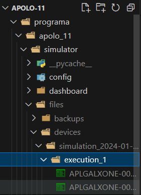

______________
# Apolo 11 🚀
______________
Apolo 11 is a program that allows simulating the generation of files with random data, such as missions, devices, device status, date, and hash, starting from a specific time. Additionally, it performs the creation of reports to analyze events, disconnections, mission consolidations, and data percentages. It also provides the capability to visualize a dashboard for obtaining a summary of the reports or relevant information derived from them.

### Prerequisites
Open the terminal and go to ...\Apolo-11\programa 

## Installation
##### *1. Execute the code "pip install poetry"*
##### *2. Activate virtual environment using "poetry shell"*
##### *3. Install dependencies using "poetry install"*

## Configuration file
Go to the folder located in the path ....\Apolo-11\programa\apolo_11\config and enter the "config.yaml" file.

Modify the variable information according to your needs. 

## Execution
To execute the program you must follow these steps:
##### *1. Open the terminal and go to ...\Apolo-11\programa\apolo_11\simulator"*
##### *2. Execute the code "python launcher.py"*
##### *3. Write 1 to start the simulation*
##### *4. Press enter to stop the simulation:*
Generated simulations can be viewed in the devices folder.

##### *5. Write 1, if you want to start a new simulation and press enter to stop the simulation*
##### *6. Write 2 to generate the reports*:
Generated reports can be viewed in the devices folder.

##### *7. Write 3 to generate the dashboard and view it in the terminal*
##### *8. Write 4 to exit the program*

## License
This project is licensed under the [MIT][def] License - see the [LICENSE][def] file for details.

[def]: LICENSE